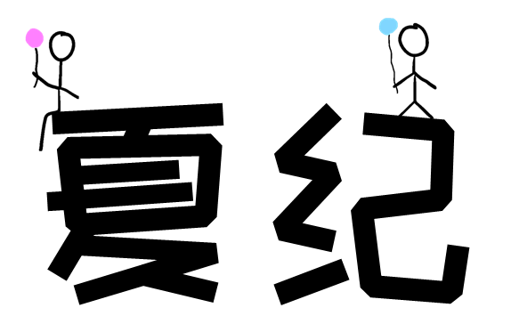

| 封面     |                 |
| -------- | ------------------------------------------------------------ |
| 曲名     | 夏纪                                                         |
| 发布时间 | 2017年2月                                                    |
| staff    | 作词：[springeight](/springeight) 作曲/编曲/调教/混音/pv：[CRS](/crs) 演唱：洛天依 言和 |
| 所属专辑 | 《65536》                                                    |
| 乐曲版权 | CC BY-NC 4.0，©双曲线工作室                                  |
| 访问     | [网易云音乐](https://music.163.com/#/song?id=1375530590)  [bilibili](https://www.bilibili.com/video/av55054822/) |

